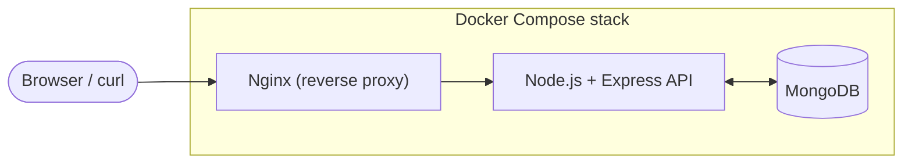
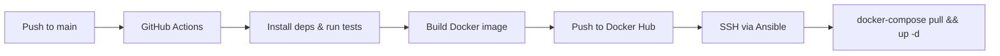

<div align="center">


# TodoOps

**A Dockerized Node.js + TypeScript + MongoDB todo API, provisioned with Terraform, configured with Ansible, shipped through GitHub Actions, and served behind Nginx.**

         

</div>

---

> 🚧 **Work in progress** — architecture and tooling decisions are final; implementation is underway.

## Contents

- [Overview](#overview)
- [Architecture](#architecture)
- [Design decisions](#design-decisions)
- [Project structure](#project-structure)
- [Getting started (local)](#getting-started-local)
- [API reference](#api-reference)
- [Environment variables](#environment-variables)
- [Production deployment](#production-deployment)
- [CI/CD pipeline](#cicd-pipeline)
- [Reverse proxy](#reverse-proxy)
- [Roadmap](#roadmap)
- [Contributing](#contributing)
- [License](#license)

## Overview

TodoOps is a small, unauthenticated todo list API whose purpose is to practise running a **multi-container application in production** end-to-end: containerizing it with Docker Compose, provisioning infrastructure with Terraform, configuring the server with Ansible, automating delivery with GitHub Actions, and fronting it with Nginx.

The application logic is intentionally simple — a handful of CRUD endpoints over MongoDB — so the focus stays on the infrastructure and delivery pipeline around it, not the app itself.

**Highlights**

- REST API for managing todos (create, read, update, delete)
- Express + TypeScript + Mongoose, with `tsx` for local hot-reload
- Two-container local stack (`api` + `mongo`) via Docker Compose
- Persistent MongoDB storage via a named Docker volume
- Infrastructure as code with Terraform (cloud VM provisioning)
- Server configuration as code with Ansible (Docker install, image pull, stack start)
- Automated build-and-deploy pipeline with GitHub Actions
- Nginx reverse proxy so the app is reachable on a bare domain

## Architecture



Locally the API is reachable directly on `http://localhost:3000`. In production Nginx sits in front so the app is reachable on port 80 at your domain.

## Design decisions

| Decision | Rationale |
|----------|-----------|
| **Docker Compose over Kubernetes** | The goal is learning the deployment lifecycle end-to-end, not orchestrating dozens of services. Compose keeps the feedback loop tight and the config readable. |
| **Ansible over a shell script** | Playbooks are idempotent and self-documenting. A shell script works once; Ansible works reliably every time and scales to multiple hosts without rewriting. |
| **Terraform for a single VM** | Even for one server, IaC means the environment is reproducible and teardown is one command. It also makes the project trivially portable across cloud providers. |
| **No authentication** | Keeps scope focused on infrastructure. Auth is important but orthogonal to the DevOps story this project tells. |
| **Nginx as a sidecar container** | Bundling the reverse proxy in the Compose stack means the entire deployment is a single `docker-compose up` — no separate Nginx install to drift out of sync. |

## Project structure

```
todoops/
├── src/
│   ├── models/
│   │   └── Todo.ts          # Mongoose schema + TS interface
│   ├── routes/
│   │   └── todos.ts         # CRUD route handlers
│   ├── app.ts               # Express app setup
│   └── server.ts            # Entry point (connect + listen)
├── infra/
│   ├── terraform/
│   │   ├── main.tf          # VM + networking
│   │   ├── variables.tf
│   │   └── outputs.tf
│   └── ansible/
│       ├── playbook.yml     # Server config + deploy
│       └── inventory.ini
├── nginx/
│   └── default.conf         # Reverse proxy config
├── .github/
│   └── workflows/
│       └── deploy.yml       # CI/CD pipeline
├── docker-compose.yml       # Local dev stack
├── docker-compose.prod.yml  # Production stack (with Nginx)
├── Dockerfile
├── tsconfig.json
├── .env.example
├── package.json
└── README.md
```

## Getting started (local)

**Prerequisites:** Docker and Docker Compose installed.

```bash
# 1. Clone the repo
git clone https://github.com/FK78/TodoOps.git
cd TodoOps

# 2. Copy the example environment file
cp .env.example .env

# 3. Start the stack
docker-compose up --build
```

The API will be available at `http://localhost:3000`. Todo data persists in MongoDB across container restarts thanks to a named volume.

**Local `docker-compose.yml`:**

```yaml
services:
  api:
    build: .
    ports:
      - "3000:3000"
    environment:
      - MONGO_URI=mongodb://mongo:27017/todos
    volumes:
      - ./src:/app/src
    depends_on:
      - mongo

  mongo:
    image: mongo:7
    volumes:
      - mongo-data:/data/db

volumes:
  mongo-data:
```

## API reference

| Method | Endpoint | Description |
|--------|----------|-------------|
| GET | `/todos` | List all todos |
| POST | `/todos` | Create a new todo |
| GET | `/todos/:id` | Get a todo by ID |
| PUT | `/todos/:id` | Update a todo by ID |
| DELETE | `/todos/:id` | Delete a todo by ID |

**Example — create a todo:**

```bash
curl -X POST http://localhost:3000/todos \
  -H "Content-Type: application/json" \
  -d '{"title": "Write the README", "completed": false}'
```

```json
{
  "_id": "665f1c2e8a1b2c0012345678",
  "title": "Write the README",
  "completed": false,
  "createdAt": "2026-07-28T09:00:00.000Z"
}
```

## Environment variables

| Variable | Description | Default |
|----------|-------------|---------|
| `PORT` | Port the API listens on | `3000` |
| `MONGO_URI` | MongoDB connection string | `mongodb://mongo:27017/todos` |

## Production deployment

### 1. Provision the server with Terraform

```bash
cd infra/terraform
terraform init
terraform plan
terraform apply
```

Creates a VM on your cloud provider and outputs its IP address.

### 2. Configure the server with Ansible

```bash
cd infra/ansible
ansible-playbook -i inventory.ini playbook.yml
```

Installs Docker and Compose on the remote host, pulls the app image from Docker Hub, and starts the production stack.

### 3. Start in production

```bash
docker-compose -f docker-compose.prod.yml up -d
```

## CI/CD pipeline



On every push to `main`, GitHub Actions builds the image, pushes it to Docker Hub, then SSHs into the server to pull the new image and restart the stack.

**Required repository secrets:**

| Secret | Purpose |
|--------|---------|
| `DOCKERHUB_USERNAME` | Docker Hub login |
| `DOCKERHUB_TOKEN` | Docker Hub access token |
| `SSH_PRIVATE_KEY` | Key for remote server access |
| `SERVER_HOST` | Remote server IP or hostname |

## Reverse proxy

An Nginx container in `docker-compose.prod.yml` proxies port 80 traffic to the API container, so the app is reachable at `http://your_domain.com` without exposing the application port directly.

## Roadmap

- [ ] Dockerize the API and MongoDB with Docker Compose + persistent storage
- [ ] Provision a remote server with Terraform and configure with Ansible
- [ ] Automate deployment with GitHub Actions
- [ ] Add Nginx reverse proxy for production
- [ ] HTTPS via Let's Encrypt (Certbot sidecar)
- [ ] Health-check endpoint + Docker health checks
- [ ] Request validation and centralized error handling
- [ ] Integration tests running in CI
- [ ] Monitoring with Prometheus + Grafana

## Contributing

Issues and pull requests are welcome. For larger changes, please open an issue first to discuss what you'd like to change.

## License

Released under the [MIT License](LICENSE).

---

<sub>Inspired by the "Multi-Container Application" project from <a href="https://roadmap.sh/projects/multi-container-application">roadmap.sh</a>.</sub>
